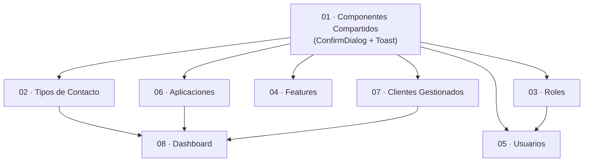

# Stratum — Índice de Requisitos

> Documentación de funcionalidades pendientes de implementación para la gestión completa de aplicaciones, usuarios, roles, features y clientes M2M a través de Stratum sobre backbone-rest.

---

## Objetivo

Stratum actualmente expone **solo vistas de lista** para usuarios, roles, features, personas, contactos y auditoría. Esta documentación especifica todas las funcionalidades de creación, edición, eliminación y gestión avanzada que deben implementarse para convertir Stratum en un backoffice operacional completo.

---

## Tabla Maestra de Módulos

| # | Documento | Módulo | Estado actual | Prioridad |
|---|---|---|---|---|
| 01 | [Componentes Compartidos](./01-componentes-compartidos.md) | `ConfirmDialog` · `Toast` | ❌ No existe | 🔴 Crítico |
| 02 | [Tipos de Contacto](./02-tipos-contacto.md) | `ContactType` CRUD | ❌ No existe | 🟠 Alta |
| 03 | [Roles](./03-roles.md) | Formularios crear/editar | ⚠️ Solo lista | 🟠 Alta |
| 04 | [Features](./04-features.md) | Formularios crear/editar | ⚠️ Solo lista | 🟠 Alta |
| 05 | [Usuarios](./05-usuarios.md) | CRUD completo + roles | ⚠️ Solo lista | 🟠 Alta |
| 06 | [Aplicaciones](./06-aplicaciones.md) | Crear aplicación | ❌ No existe | 🟡 Media |
| 07 | [Clientes Gestionados](./07-clientes-gestionados.md) | M2M OAuth2 CRUD | ❌ No existe | 🟡 Media |
| 08 | [Dashboard](./08-dashboard.md) | Navegación actualizada | ⚠️ Incompleto | 🟢 Baja |

---

## Grafo de Dependencias



---

## Orden de Implementación Recomendado

```
01 → 02 → 03 → 04 → 05 → 06 → 07 → 08
```

| Paso | Módulo | Razón |
|---|---|---|
| **1** | Componentes Compartidos | Bloqueante — `ConfirmDialog` y `Toast` son necesarios en todos los CRUD |
| **2** | Tipos de Contacto | El más simple — patrón CRUD completo de referencia |
| **3** | Roles | Servicio y BFF completos — solo falta UI |
| **4** | Features | Idéntico a Roles — replica el patrón |
| **5** | Usuarios | El más complejo — depende de roles para el selector |
| **6** | Aplicaciones | API limitada — solo creación disponible |
| **7** | Clientes Gestionados | Módulo nuevo completo — mayor esfuerzo |
| **8** | Dashboard | Agrega navegación para los módulos nuevos |

---

## Convenciones Globales

Todos los módulos documentados en este repositorio siguen las convenciones de `CLAUDE.md`:

| Convención | Regla |
|---|---|
| **Componentes** | `standalone: true` siempre |
| **Inyección** | `inject()` — nunca constructor injection |
| **Control de flujo** | `@if`, `@for` — nunca `*ngIf`/`*ngFor` |
| **HTTP** | Solo `HttpService` — nunca `HttpClient` directamente |
| **Estado global** | NgRx — signals para estado local de componente |
| **URLs** | Siempre constantes de `API` en `api.constants.ts` |
| **SSR** | `StorageMockService` para `localStorage`/`window` |
| **Comentarios** | Solo si el WHY no es obvio |
| **Idioma UI** | Español (`es`) — `@ngx-translate` |

---

## Arquitectura de Referencia

```
Stratum (Angular 20 + Express BFF)
├── src/app/
│   ├── core/
│   │   ├── guards/         authGuard — protege rutas
│   │   ├── interceptors/   auth · error · loading
│   │   ├── services/       HttpService + servicios por dominio
│   │   └── store/session/  NgRx — autenticación global
│   ├── features/           Un directorio por módulo (lazy-loaded)
│   └── shared/
│       ├── constants/      api.constants.ts — todos los paths
│       ├── components/     Componentes reutilizables (a crear)
│       └── models/         Interfaces TypeScript por dominio
└── server/
    ├── routes/             Proxy BFF → backbone-rest
    └── shared/proxy.js     proxyToBackbone(req, res, path)
```

---

## Glosario

| Término | Definición |
|---|---|
| **BFF** | Backend for Frontend — Express.js que hace proxy a backbone-rest |
| **backbone-rest** | API upstream en `BACKBONE_BASE_URL/api/v1/` |
| **HttpService** | Wrapper sobre `HttpClient` — único punto de acceso HTTP en el frontend |
| **proxyToBackbone** | Función en `server/shared/proxy.js` — todos los routes la usan |
| **session-token** | Header de autenticación usado por backbone-rest |
| **M2M** | Machine-to-Machine — clientes OAuth2 sin interacción humana |
| **envelope** | Patrón de API donde el objeto se anida: `{ entity, dateTime, appName, appToken }` |
